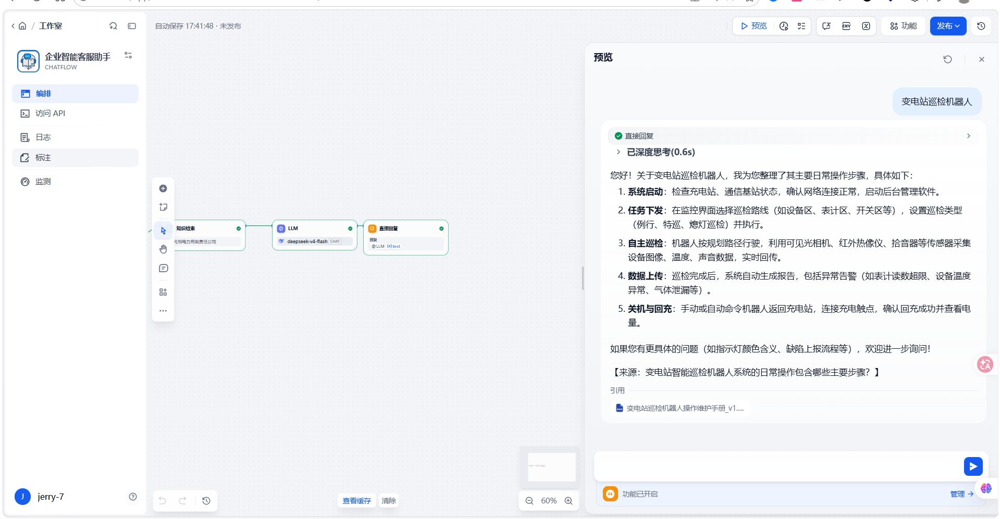
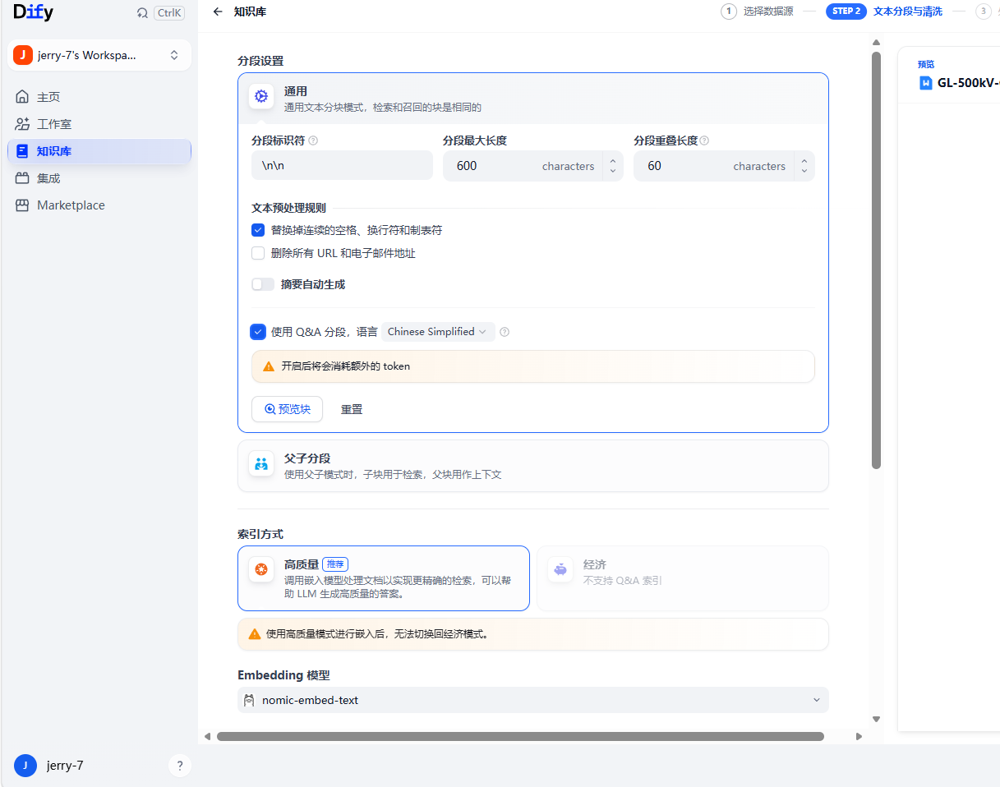

# 企业级智能知识库问答系统

> 基于 Dify + DeepSeek API + Ollama 本地 Embedding 构建的私有化 RAG 智能问答系统

---

## 📌 项目简介

本项目针对企业文档分散、技术参数查找效率低的痛点，设计并部署了一套私有化的智能知识库问答系统。系统通过 RAG（检索增强生成）技术，将非结构化的产品规格书、FAQ 手册、操作维护指南等文档转化为可自然语言检索的知识资产，员工提问后平均 30 秒内即可获得精准答案。

**核心价值：**
- 文档查找效率提升 **20 倍**（从 10~15 分钟降至 **<30 秒**）
- 知识库支持多格式文档（DOCX/PDF/Excel/TXT）批量导入与统一检索
- 全部服务本地私有化部署，满足企业数据隐私与安全合规要求

---

## 🏗️ 技术架构

### 整体架构图
┌─────────────────────────────────────────────────────────────────┐
│ 用户交互层 │
│ ┌─────────────────────────────────────────────────────────┐ │
│ │ Dify Chatflow 对话界面 │ │
│ └─────────────────────────────────────────────────────────┘ │
└─────────────────────────────────────────────────────────────────┘
│
▼
┌─────────────────────────────────────────────────────────────────┐
│ 工作流编排层（Dify） │
│ ┌──────────┐ ┌──────────────────┐ ┌──────────────┐ │
│ │ 用户输入 │ → │ 知识检索节点 │ → │ LLM 节点 │ │
│ │ 节点 │ │ (混合检索/TopK=4) │ │ (DeepSeek) │ │
│ └──────────┘ └──────────────────┘ └──────────────┘ │
│ │ │ │
│ ▼ ▼ │
│ ┌──────────────────┐ ┌──────────────┐ │
│ │ Weaviate │ │ 直接回复 │ │
│ │ 向量数据库 │ │ 节点 │ │
│ └──────────────────┘ └──────────────┘ │
└─────────────────────────────────────────────────────────────────┘
│
▼
┌─────────────────────────────────────────────────────────────────┐
│ 基础设施层 │
│ ┌──────────────┐ ┌──────────────┐ ┌────────────────────┐ │
│ │ DeepSeek │ │ Ollama │ │ Docker │ │
│ │ API │ │ (本地) │ │ + WSL2 │ │
│ │ (LLM) │ │ nomic-embed │ │ (容器编排) │ │
│ └──────────────┘ └──────────────┘ └────────────────────┘ │
└─────────────────────────────────────────────────────────────────┘


### 技术栈

| 层级 | 技术选型 | 说明 |
|------|---------|------|
| AI 应用开发平台 | **Dify**（开源社区版） | 工作流编排、知识库管理、RAG 全链路支持 |
| 大语言模型（LLM） | **DeepSeek API**（deepseek-v4-flash） | 中文理解能力强，性价比高 |
| 文本向量化（Embedding） | **Ollama + nomic-embed-text**（本地部署） | 完全离线运行，零成本，数据不出本地 |
| 向量数据库 | **Weaviate**（Dify 内置） | 存储与检索文档向量 |
| 检索策略 | **混合检索**（Keyword + Vector） | 兼顾精确匹配与语义理解 |
| 容器编排 | **Docker Compose + WSL2** | Windows 环境私有化一键部署 |

### 为什么选择这套技术组合？

| 决策点 | 方案 | 理由 |
|--------|------|------|
| LLM 选型 | DeepSeek API | 中文能力优秀，API 成本远低于 OpenAI，适合企业级落地 |
| Embedding 选型 | Ollama + nomic-embed-text | DeepSeek API 不支持向量化，本地部署方案完全免费且保护数据隐私 |
| 工作流平台 | Dify | 开源、可私有化部署，提供完整的 RAG 工作流编排能力 |
| 部署方式 | Docker Compose | 一键启动 10+ 微服务容器，便于维护和迁移 |

---

## 📂 知识库文档结构
knowledge-base/
├── GL-500kV-GIS技术规格书_v2.1.docx # 产品技术规格文档
├── 居民用电报装与缴费FAQ_v3.0.docx # FAQ 问答手册
└── 变电站巡检机器人操作维护手册_v1.0.docx # 操作维护指南


**文档处理策略：**
- 分段最大长度：600 字符
- 分段重叠长度：60 字符
- 分段标识符：`\n\n`（按段落切分）
- 索引模式：高质量（High Quality）
- Embedding 模型：nomic-embed-text

---

## 🎯 效果演示

### 技术规格查询


### 知识库配置


### Embedding 构建


---

## ⚙️ 部署与运行

### 环境要求

- Windows 10/11 + WSL2 或 macOS / Linux
- Docker Desktop
- 8GB+ 内存（推荐 16GB）

### 快速部署步骤

```bash
# 1. 克隆 Dify 仓库
git clone https://github.com/langgenius/dify.git
cd dify/docker

# 2. 配置环境变量
copy .env.example .env

# 3. 启动 Dify 服务
docker-compose up -d

# 4. 访问 Dify
http://localhost

# 1. 安装 Ollama 并下载 Embedding 模型
ollama pull nomic-embed-text

# 2. 在 Dify 中配置 Ollama
# 模型类型: Text Embedding
# 模型名称: nomic-embed-text
# 基础 URL: http://host.docker.internal:11434
